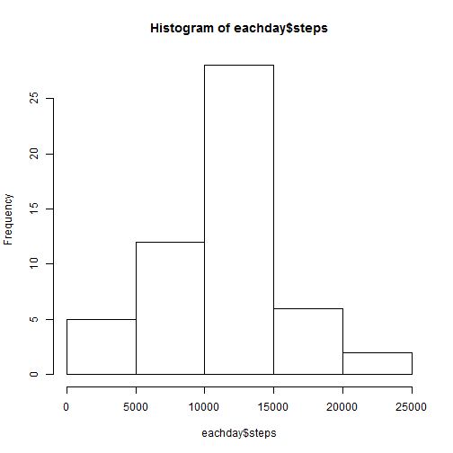
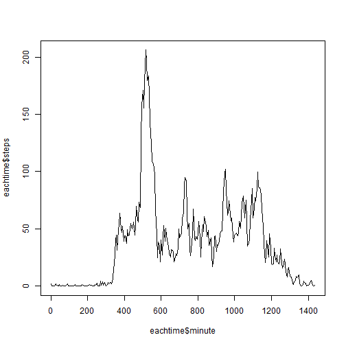
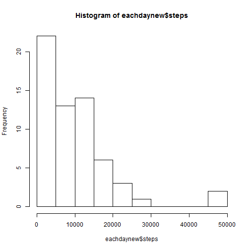
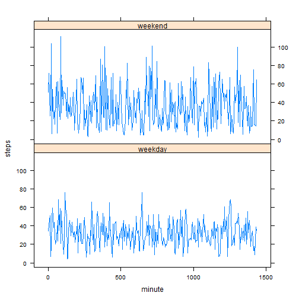

## Loading and preprocessing the data

Extract the zip file and load the data with classes of the columns defined.


```r
unzip("./activity.zip")
activity <- read.csv("./activity.csv", na.strings = "NA", 
                     colClasses = c("numeric", "Date", "integer"))
head(activity, 3)
```

```
##   steps       date interval
## 1    NA 2012-10-01        0
## 2    NA 2012-10-01        5
## 3    NA 2012-10-01       10
```

```r
tail(activity, 3)
```

```
##       steps       date interval
## 17566    NA 2012-11-30     2345
## 17567    NA 2012-11-30     2350
## 17568    NA 2012-11-30     2355
```

Convert the time interval into *actual* minute value.


```r
activity$minute <- sapply(activity$interval, function(x) {x%/%100*60+x%%100})
head(activity, 3)
```

```
##   steps       date interval minute
## 1    NA 2012-10-01        0      0
## 2    NA 2012-10-01        5      5
## 3    NA 2012-10-01       10     10
```

```r
tail(activity, 3)
```

```
##       steps       date interval minute
## 17566    NA 2012-11-30     2345   1425
## 17567    NA 2012-11-30     2350   1430
## 17568    NA 2012-11-30     2355   1435
```


## What is mean total number of steps taken per day?

A histogram of the total number of steps taken each day.


```r
eachday <- aggregate(steps ~ date, data = activity, FUN = sum)
hist(eachday$steps)
```

 

**mean** total number of steps taken per day (ignoring missing values).

```r
mean(eachday$steps)
```

```
## [1] 10766
```

**median** total number of steps taken per day (ignoring missing values).

```r
median(eachday$steps)
```

```
## [1] 10765
```


## What is the average daily activity pattern?

A time series plot of the 5-minute interval (x-axis) 
and the average number of steps taken, averaged across all days (y-axis)


```r
eachtime <- aggregate(steps ~ minute + interval, data = activity, FUN = mean)
plot(eachtime$minute, eachtime$steps, type = "l")
```

 

The 5-minute interval, on average across all the days in the dataset,
that contains the maximum number of steps.


```r
eachtime[eachtime$steps >= max(eachtime$steps), ]
```

```
##     minute interval steps
## 104    515      835 206.2
```


## Imputing missing values

Total number of missing values in the dataset.

```r
sum(!complete.cases(activity))
```

```
## [1] 2304
```

Fill in all the missing values by the median for that 5-minute interval.
I have chosen that because it is fun to do something that is not suggested also not forbidden.

Create a new dataset that is equal to the original dataset but with the missing data filled in.


```r
newdata <- activity
newdata$steps <- with(newdata, do.call(c, tapply(steps, minute, function(y) {
    ym <- median(y, na.rm=TRUE)
    y[is.na(y)] <- ym
    y
})))
```

A histogram of the total number of steps taken each day of new dataset.


```r
eachdaynew <- aggregate(steps ~ date, data = newdata, FUN = sum)
hist(eachdaynew$steps)
```

 

**mean** total number of steps taken per day of new dataset.

```r
mean(eachdaynew$steps)
```

```
## [1] 9504
```

**median** total number of steps taken per day of new dataset.

```r
median(eachdaynew$steps)
```

```
## [1] 9069
```


## Are there differences in activity patterns between weekdays and weekends?

Create a new factor variable in the dataset with two levels - "weekday" and "weekend".


```r
newdata$daytype <- as.factor(sapply(weekdays(newdata$date), function(x) {
    if(grepl("^S", x)) "weekend"
    else "weekday"
}))
```

A panel plot containing a time series plot of the 5-minute interval (x-axis) 
and the average number of steps taken, averaged across all weekday days or weekend days (y-axis).


```r
library(lattice)
bydaytype <- aggregate(steps ~ minute + daytype, data = newdata, FUN = mean)
xyplot(steps ~ minute | daytype, data = bydaytype, type = "l", layout = c(1, 2))
```

 

